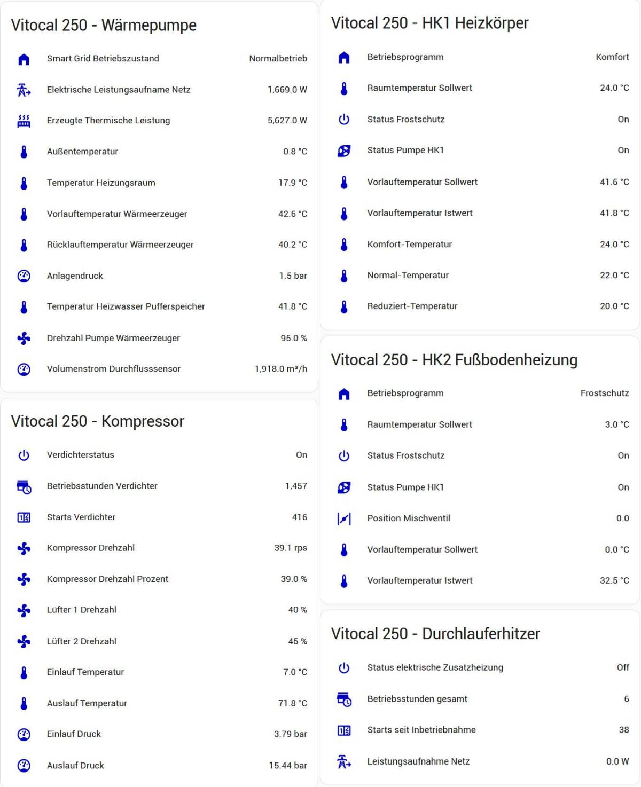

# Anschluß einer Viessmann Vitocal 250 mit USB-CAN-Bus-Adapter und Open3E 

Diese Beschreibung ist eine Dokumetation, wie ich mein System zum laufen gebracht habe. 

## Installation Linux (Dank, geht an Sebliner https://github.com/abnoname/open3e/issues/10#issuecomment-1828502180)

Iso von Debian Buster 10.13 von debian.org herunterladen (debian-10.13.0-amd64-netinst.iso) und in VM installieren.

Danach als "root" folgende Befehle ausführen. 

1. Die Datei sources.list bearbeiten

    nano /etc/apt/sources.list

    "deb http://deb.debian.org/debian buster-backports main" einfügen und Datei speichern.

2. System mit folgenden befehlen updaten

    apt-get update
    apt-get install linux-image-5.10.0-0.deb10.16-amd64
    apt-get install linux-headers-5.10.0-0.deb10.16-amd64

3. Linux rebooten

        reboot
    
    und danach folgenden Befehl eingeben.

        uname -a

    Bei mir dann folgender Kernel angezeigt: "Linux debian10open3e 5.10.0-0.deb10.16-amd64 #1 SMP Debian 5.10.127-2bpo10+1 (2022-07-28) x86_64 GNU/Linux"

4. Linux vorbereiten

    USB-CAN-Adapter am NAS (auf dem die VM läuft anschließen) und diesen USB-Adapter an die VM durchreichen und mit 

    lsusb 

    prüfen ob der CAN-USB-Adapter innerhalb von Linux verfügbar ist. Bei mir wird der Adpater als "OpenMoko, Inc." angezeigt. 

    ip addr | grep "can" 

    zeigt hinter state "UP" oder "DOWN" an. Sollte er nicht "UP" sein muss der CAN initialisiert werden 

        sudo ip link set can0 type can bitrate 250000
        sudo ifconfig can0 up    
    
    Can-Adapter neu starten:

        sudo ip link set can0 down
        sudo ip link set can0 up type can bitrate 250000

## Installation von Open3E 

1. Im Home-Verzeichns (bei mir wolfgang@debian10open3e) das Unterverzeichnis "git" anlegen
2. Mit "cd git" in dieses Verzeichnis wechseln
3. Mit folgendem Befehl den aktuellen Master-Branch von Open3E herunterladen/installieren

    git clone https://github.com/abnoname/open3e.git

4. In das Verzeichnis open3e wechseln "cd open3e"

Der Befehl 

    python3 Open3Eclient.py -c can0 -dev vcal -r 274 -v

sollte dann in etwa ein solches Ergebnis bringen

    274 OutsideTemperatureSensor {'Actual': 8.6, 'Minimum': 0.0, 'Maximum': -0.1, 'Average': 7.2, 'Unknown': 0}

5. Wenn das funktioniert, dann sollte ein vollständiger Scann des Systems mit allen verfügbaren DIDs gemacht werden

    python3 Open3E_depictSystem.py -s

Dieser Vorgang kann 15-20 Minuten dauern, bitte geduldig bleiben. Im ersten Schritt werden die ECUs (x680..x6ff) ermittelt, auf welchen Geräte antworten. Bei mir sind das folgende ECUs: 

    680: HPMUMASTER 
    684: HMI
    68c: VCMU
    6c3: BACKENDGATEWAY
    6c5: BACKENDGATEWAY
    6cf: EHCU

Danach werden bei diesen ECUs die DIDs im Bereich von 256 .. 3500 ermittelt. Bei ECU 680 (HPMUMASTER) werden relativ viele DIDs gefunden, aber je nach Anlage und Anzahl der verbauten Komponenten sind es nur sehr wenige DIDs in bei den anderen ECUs. Deshalb wird manchmal relativ lange kein Fortschritt angezeigt, geduldig bleiben. 

Sobald der Scann abgeschlossen ist, sind folgende neuen Dateien im Verzeichnis "open3e" vorhanden.

    devices.json
    Open3Edatapoints_680.py
    Open3Edatapoints_684.py
    Open3Edatapoints_68c.py
    Open3Edatapoints_6c3.py
    Open3Edatapoints_6c5.py
    Open3Edatapoints_6cf.py
    virtdata_680.txt
    virtdata_684.txt
    virtdata_68c.txt
    virtdata_6c3.txt
    virtdata_6c5.txt
    virtdata_6cf.txt

Je nach Anlage kann das bei Euch natürlich auch anders aussehen. In der Datei "devices.json" steht, welche ECUs bei deinem System vorhanden sind. In den Dateien "Open3Edatapoints_6xx.py" steht, welche DIDs Werte geliefert haben und künftig abgefragt werden können. In den Dateien "virtdata_6xx.txt" stehen die Werte welche die Anlage zum Zeitpunkt dieses Scanns geliefert hat.  

6. In das Verzeichnis "git", also unterhalb vom Verzeichnis "open3e" die Datei "args.txt" aus diesem Repository kopieren, bearbeiten und die IP-Adresse vom MQTT-Server sowie Username und Passwort für den MQTT-Server anpassen.

    nano args.txt

Danach wieder in das Verzeichnis "open3e" wechseln und den Befehl 

    python3 Open3Eclient.py @../args.txt

ausführen. Das führt dazu, dass alle 30 Sekunden die DIDs an den MQTT-Server (Mosquitto broker) von Home Assistant geliefert werden. 

## Device und Entities in Home Assistant bereitstellen

Ich binde die verschiedenen Geräte mittels "packages" ein. Das hat den Vorteil, dass alle Entitäten (Sensoren) von einem Gerät (hier: Vitocal 250-A) in einer Datei stehen. Um Packages einzubinden muss folgender Eintrag in der configuration.yaml unterhalb von "homeassistant:" gemacht werden:

    homeassistant:
      packages: !include_dir_named packages

Ferner muss im "File editor" im Home Assistant das Unterverzeichnis "packages" angelegt werden, in welches dann die "vitocal250.yaml" kopiert wird. Mit der vitocal250.yaml werden alle Entitäten (Sensoren, binäre Sensoren und Regler) automatisch angelegt. Dabei bekommt jede Entität sowohl eine "unique_id", einen deutschen Namen, eine Zuordnung zum Device "Open3e_Vitocal250A", ein passendes Icon und eine fest vorgegebene "entity_id" (=object_id). Der Indentifier beim Device sollte/kann natürlich durch die Seriennummer des eigenen Gerätes ersetzt werden. Da habe ich jetzt nur einen Dummy eingetragen. Nach einem Neustart von Home Assistant sollten dann alle Entitäten verfügbar sein. 

## Visualisierung in Home Assistant 

1. Lovelace-Karte

Auf einer beliebigen Seite eine neue Karte "Vertical stack" hinzufügen, unten Links auf "Show Code Editor" klicken und den Code aus der Datei "lovelace\vitocal250_card.yaml" hinein kopieren. 

2. Keislauf-Übersicht

Zuerst muss die Datei "kreislauf.png" mittels "File editor" im Home Assistant in das Verzeichnis "www" kopiert werden. Danach eine neue Karte "Picture elements" anlegen und dort den Code aus der Datei "lovelace\vitocal250_view.yaml" hinein kopieren. Der Dank geht hier an "[gravitas15](https://github.com/open3e/open3e/discussions/54)".

Im Home Assistant kann über "Device" auf die Regler von "Heizkreis 1" und "Heizkreis 2" zugegriffen werden. Diese Regler ermöglichen es auch die Einstellungen des jeweiligen Heizkreises direkt aus Home Assistant zu ändern. Ich habe das dabei so programmiert, dass bei einer Temperaturänderung immer automatisch die Temperatur für alle 3 Betriebsprogramme geändert wird. Das bedeutet, je nach dem in welchem Betriebsprogramm (Reduziert, Normal, Komfort) sich der Heizkreis aktuell befindet, wird die Temperatur immer für die 3 Programme mit einem Abstand von 2 °C eingestellt. 
Beispiel 1: Befindet sich HK1 im Programm "Normal" bei 20 °C und wird die Temperatur auf 22 °C erhöht, dann wird "Reduziert" auf 20 °C, "Normal" auf 22 °C und "Komfort" auf 24 °C eingestellt. 
Beispiel 1: Befindet sich HK1 im Programm "Komfort" bei 20 °C und wird die Temperatur auf 22 °C erhöht, dann wird "Reduziert" auf 18 °C, "Normal" auf 20 °C und "Komfort" auf 22 °C eingestellt. 

